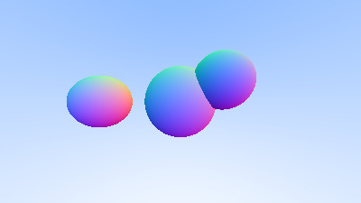

# C++ Ray Tracer

An implementation fo a ray-tracer in C++, demonstrating fundamental computer graphics concepts.

## Features

- Ray-sphere intersection with surface normal shading.
- Virtual camera system with configurable viewport.
- 3D vector mathematics (dot product, cross product, normalization)
- PPM image output

## Technical Highlights

- Demonstrates understanding of graphics pipeline fundamentals.
- Clean, readable C++ code following modern practices.

## Sample Output



# Build

```bash
g++ -std=c++11 source/main.cpp -o ray-tracer_demo
```

## Furture Improvements

- Multiple objects and materials.
- Lighting models (diffuse, specular)
- Reflections and refractions